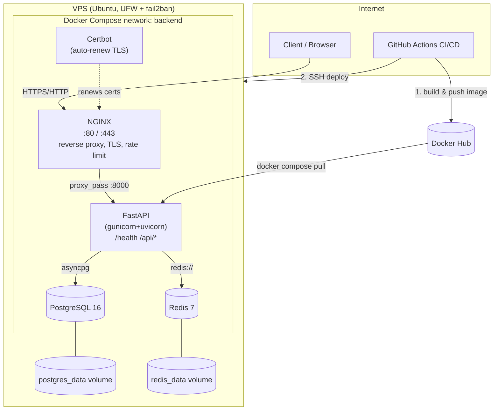

# Architecture

## Request flow

1. Client hits the server on port 80/443.
2. NGINX terminates TLS (if configured), applies security headers and rate
   limiting, then proxies to the FastAPI container over the internal
   `backend` Docker network.
3. FastAPI handles the request, talking to Postgres (via `asyncpg`/
   SQLAlchemy async) and Redis (via `redis.asyncio`) as needed.
4. Postgres and Redis persist data to named Docker volumes, which survive
   container restarts/recreations.

## Deploy flow

1. Developer pushes to `main`.
2. GitHub Actions builds the Docker image and pushes it to Docker Hub,
   tagged with both `latest` and the commit SHA.
3. Actions copies the current `docker-compose.yml` and `nginx/` configs to
   the server (so infra changes deploy too, not just app code).
4. Actions SSHes in, updates `.env` with the new image tag, pulls the
   image, and recreates only the `api` container.
5. A health-check loop confirms `/health` returns 200 before the pipeline
   reports success; otherwise it fails loudly with logs.

## Why this network layout

Postgres and Redis are **not** published to the host at all — they're only
reachable from other containers on the `backend` Docker network. Combined
with the VPS firewall (UFW) only allowing 22/80/443 inbound, there are two
independent layers keeping the database and cache off the public internet
even if one layer is misconfigured.
